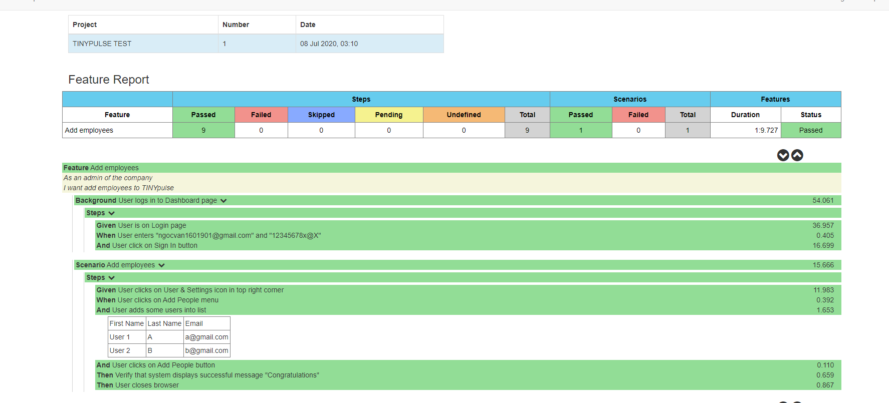

# CUCUMBER TEST
## How to run the script
I intend to create an executable jar file to run the script easily, but I face some issues. Currently, I just run the script by using the Maven command. To go on that way we have to setup Java and Maven. After that, we go to the test folder and open the CMD tool of Windows and type mvn clean verify.

## Rerport
The report(overview-features.html) is generated in folder with path: test\target\site\cucumber-reports\cucumber-html-reports.

That project still has somethings that need to be improved. So if there is any comment please feel free to reach me at ngocvan160190@gmail.com.
